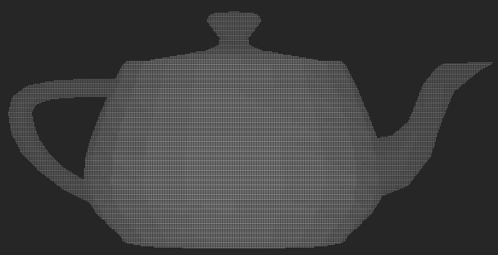
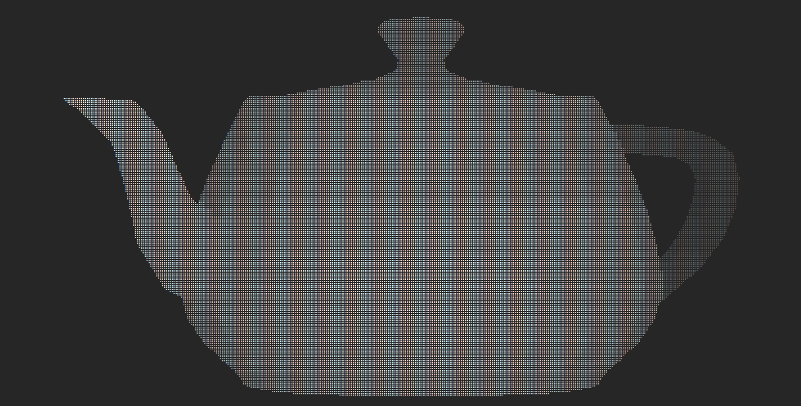
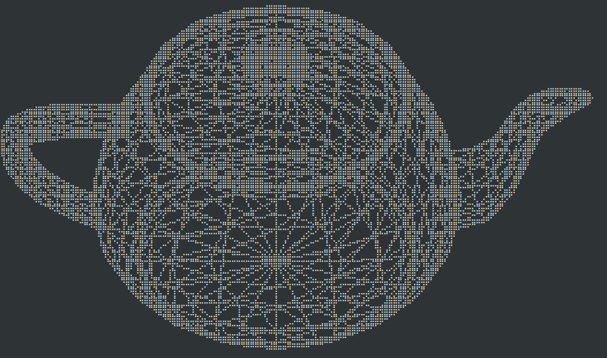

# Termesh

Explore 3D meshes in your terminal!



## Usage

```shell
$ cargo run --release -- --help
$ cargo run --release -- data/teapot.stl
$ cargo run --release -- data/teapot.stl --wireframe --non-interactive --rotation-x 0.8 --scale 40 --no-depth
$ cargo run --release -- data/demo.tmesh
```

## DSL

`termesh` has a custom DSL that can be used to draw 3D objects without going
through the process of building and exporting the mesh in a separate sofware. A
DSL is also useful because it plays well with version control. Here's an example
of what the DSL is currently capable of.

```python
# define vertices
vertex v1 =  0    0    0
vertex v2 =  0.5  0.5  0.5
vertex v3 = -0.5 -0.5 -0.5

# draw lines
line v1 v2

# draw triangles
triangle v1 v2 v3
```

## Keybindings

<pre>
<kbd>q</kbd>: Quit
<kbd>s</kbd>: Save current frame to file
<kbd>x</kbd>: Rotate on the X axis counterclockwise
<kbd>X</kbd>: Rotate on the X axis clockwise
<kbd>y</kbd>: Rotate on the Y axis counterclockwise
<kbd>Y</kbd>: Rotate on the Y axis clockwise
<kbd>z</kbd>: Rotate on the Z axis counterclockwise
<kbd>Z</kbd>: Rotate on the Z axis clockwise
</pre>
